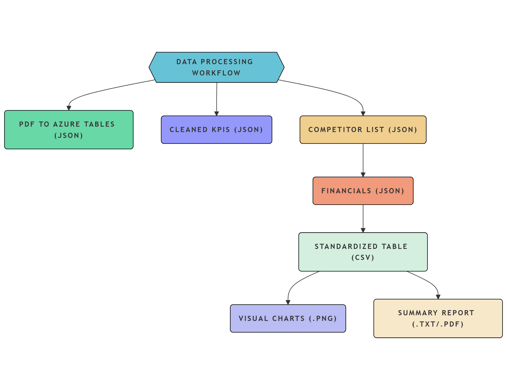

# GenAI Benchmarking Tool for PortCos

## Overview

The **GenAI Benchmarking Tool for PortCos** is an AI-powered financial analysis pipeline that automates the extraction, benchmarking, and reporting of financial metrics for portfolio companies. This project was developed as a UCL Computer Science final year project in collaboration with Alvarez & Marsal.

The pipeline leverages modern AI technologies to transform manual financial analysis workflows that typically take days into an automated process that runs in minutes:

- **Document Intelligence**: Extract structured data from financial PDFs
- **Competitor Identification**: Automatically identify suitable public company benchmarks
- **Financial Analysis**: Generate comparison metrics, visualizations, and narrative insights
- **Reporting**: Create comprehensive analysis reports with human-quality commentary



## Features

- **PDF Processing**: Automatically extract financial metrics from uploaded PDF reports using Azure Document Intelligence
- **Competitor Discovery**: Identify relevant public competitors using Perplexity AI and financial APIs
- **Data Standardization**: Clean and normalize financial metrics across companies
- **Visualization**: Generate PowerBI-style comparative charts with industry benchmarks
- **AI-Powered Reports**: Create analyst-quality commentary using GPT-4o
- **Web Interface**: Access all features through an intuitive Flask dashboard
- **Docker Integration**: Run the entire pipeline in a containerized environment

## Technical Architecture

The system follows a modular pipeline architecture:

1. **Document Intelligence Module** (azure_processing.py)
   - Extracts structured financial data using Azure Document Intelligence
   - Identifies financial statements and key metrics

2. **Competitor Identification Module** (perplexity_api_competitor_research_with_fin_APIs.py)
   - Uses Perplexity AI for competitor discovery
   - Retrieves financial data via Alpha Vantage and Finnhub

3. **Data Cleaning Module** (clean_collected_data.py)
   - Standardizes and normalizes financial metrics
   - Creates comparison datasets in multiple formats

4. **Chart Generation Module** (generate_PowerBI_graphs.py)
   - Creates PowerBI-style visualizations
   - Generates industry benchmark comparisons

5. **Report Generation Module** (generate_report.py)
   - Produces AI-generated financial analysis
   - Creates PDF and text reports

6. **Web Interface** (app.py)
   - Provides user-friendly upload and results dashboard

## Installation

### Prerequisites

- Docker and Docker Compose
- API keys for:
  - Azure Document Intelligence
  - Perplexity AI
  - Alpha Vantage
  - Finnhub
  - OpenAI (for GPT-4o)

### Docker Installation (Recommended)

1. Clone the repository:
   ```bash
   git clone https://github.com/peterpetrov123/GenAI-Benchmarking-Tool-for-PortCos.git
   cd GenAI-Benchmarking-Tool-for-PortCos
2. Create an .env file with your API keys:
   ```bash
   # Azure Document Intelligence
   AZURE_DOC_INTELLIGENCE_ENDPOINT=https://your-endpoint.cognitiveservices.azure.com/
   AZURE_DOC_INTELLIGENCE_API_KEY=your_key_here
   
   # Azure Blob Storage (optional)
   AZURE_STORAGE_SAS_URL=https://yourstorage.blob.core.windows.net
   AZURE_STORAGE_SAS_TOKEN=your_sas_token
   AZURE_CONTAINER_NAME=your_container
   
   # Perplexity
   PERPLEXITY_API_KEY=your_key_here
   
   # Financial APIs
   ALPHA_VANTAGE_API_KEY=your_key_here
   FINNHUB_API_KEY=your_key_here
   
   # OpenAI/Azure OpenAI
   OPENAI_API_KEY=your_key_here
   OPENAI_API_URL=https://your-endpoint.openai.azure.com/openai/deployments/your-deployment/chat/completions?api-version=2023-05-15
4. Build and run with Docker Compose:
   ```bash
   docker-compose up --build
5. Access the web interface at http://localhost:5000

### Manual Installation 

1. Clone the repository and set up a virtual environment:
   ```bash
   git clone https://github.com/peterpetrov123/GenAI-Benchmarking-Tool-for-PortCos.git
   cd GenAI-Benchmarking-Tool-for-PortCos
   python -m venv venv
   source venv/bin/activate  # On Windows: venv\Scripts\activate
2. Install dependencies:
   ```bash
   pip install -r requirements.txt
3. Create an .env file as described above
4. Run the Flask application:
   ```bash
   python app.py

## Usage

### Web Interface
1. Access the web application at http://localhost:5000
2. Upload a financial PDF report using the interface
3. Track analysis progress in real-time
4. View and download results (charts, reports, comparison data)

### Command Line
Each module can also be run independently:
   ```bash
   # Process a PDF and extract financial metrics
   python azure_processing.py path/to/financial_report.pdf --output ./financial_data
   
   # Identify competitors and retrieve their financials
   python perplexity_api_competitor_research_with_fin_APIs.py "Company Name" ./financial_data/financial_metrics.json ./competitor_analysis
   
   # Clean and standardize data
   python clean_collected_data.py --metrics ./financial_data/financial_metrics.json --competitors ./competitor_analysis/competitors.json --financials ./competitor_analysis/competitor_financials.json
   
   # Generate charts
   python generate_PowerBI_graphs.py --csv ./competitor_analysis/comparison.csv --output ./competitor_analysis/charts
   
   # Generate reports
   python generate_report.py --csv ./competitor_analysis/comparison.csv --charts-dir ./competitor_analysis/charts --output-dir ./competitor_analysis
   ```

## Example Output

The system generates several types of outputs:

### 1. Structured Financial Data
- Financial metrics extracted from the input PDF
- Competitor financial data retrieved from APIs
- Normalized comparison datasets in CSV, Excel, and JSON formats

### 2. Visualization Charts
 

### 3. Analysis Reports
- Executive Summary
- Competitive Position Analysis
- Financial Performance Deep Dive
- Risk Assessment
- Strategic Recommendations

## Future Enhancements

- **Interactive Dashboard**: Replace static charts with interactive D3.js visualizations
- **Time-Series Analysis**: Add historical trending and forecasting capabilities
- **Anomaly Detection**: Implement ML models to identify financial outliers automatically
- **Industry-Specific Models**: Train specialized models for different sectors (Pharma, Tech, Retail)
- **Multilingual Support**: Extend document processing to non-English financial reports
- **Private Company Database**: Integrate with private company data sources for broader comparisons
- **Explainable AI**: Add transparency features to explain AI-generated insights

## Academic Research Context

This project sits at the intersection of several research domains:
- **Document Intelligence**: Applying vision + language models to semi-structured financial documents
- **Financial NLP**: Extracting, normalizing, and analyzing numerical financial data
- **Generative AI**: Using large language models for domain-specific financial analysis
- **Human-AI Collaboration**: Augmenting financial analyst workflows with AI automation

The full academic report explores these areas in depth and provides formal evaluation methodology. Which you can find in the Documentation folder.

## Security and Data Privacy

This tool is designed with data privacy in mind:
- No client data is stored permanently
- API keys are stored in environment variables, not in the codebase
- All data processing happens locally within the Docker container
- Financial data caching is time-limited and can be disabled

## Known Limitations

- Limited to English-language financial reports
- Requires high-quality PDF inputs for optimal extraction
- API rate limits may restrict processing volume

## Acknowledgements

- Alvarez & Marsal for project support and domain expertise
- UCL Computer Science for academic supervision
- OpenAI, Microsoft Azure, and Perplexity AI for API access
- Financial analysts who participated in usability testing

## Author

Peter Petrov - UCL Computer Science
### 


